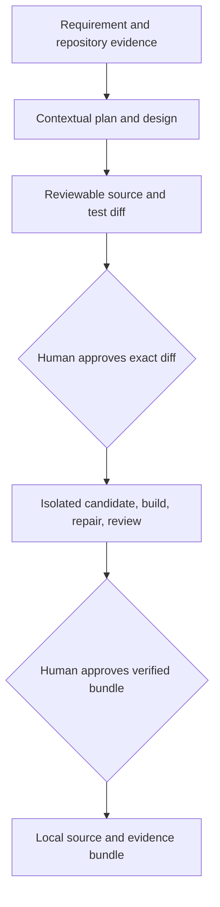

# Architecture and orchestration model

## Service components

Spring MVC validates the request shape, applies a per-process creation limit, and delegates link rules to the domain service. JDBC uses parameterized statements. Click increments run in a short SQLite `BEGIN IMMEDIATE` transaction so concurrent redirects do not silently lose counts. The stored analytics are aggregate click counts and last-access timestamps; visitor IPs are not persisted.

## Engineering workflow

`WorkflowGraph` validates unique stage IDs, known dependencies, and acyclicity. Requirement intake, repository reasoning, decomposition, and architecture feed implementation. The implementation agent returns complete-file operations. A policy layer validates safe relative paths, Java source/test extensions, file counts, bytes, criterion IDs, and create/update/delete semantics before it renders a diff. A named reviewer approves that exact proposal hash before the orchestrator applies it to the per-run candidate workspace.

Brownfield candidates copy only Maven build inputs (`pom.xml`, Maven configuration/wrapper files, and `src/`); credentials, Git history, workflow state, unrelated files, and build output stay outside. Greenfield candidates start with only the Maven `pom.xml`; generated application source and tests must be supplied by the provider. The original working tree is never modified by the workflow. Maven runs from the candidate directory using a fixed command and timeout. The current checkout fingerprint is checked again before apply and before each approval.

## Contextual model and fallback

Set `AGENT_BASE_URL`, `AGENT_MODEL`, and, when required, `AGENT_API_KEY` to use an OpenAI-compatible `/v1/chat/completions` provider. The request carries the user's requirement, prior-stage decisions, repository Java files, and validation output. Each stage has a JSON response contract. The HTTP client has a connect timeout and bounded request timeout; response bodies are parsed as JSON and artifact sizes are limited.

Without a provider, the offline implementation can inspect the repository and run local checks, but it returns `incomplete` for source generation and repair. Provider errors may fall back to this offline inspector. That fallback does not fabricate source, mark tests passed, or bypass approval. An incomplete or unvalidated result cannot pass readiness.

## State, evidence, and lineage

`.agentic/state.sqlite3` stores run projections, stage state, approval history, leases, and append-only events. Every run has a trace ID. JSON artifacts under `.agentic/runs/{run_id}/artifacts/` include the interpreted requirement, repository analysis, task plan, architecture, complete patch proposal, generated diff, candidate application, initial test result, repair history, final validation, security report, and grounded engineering summary.

Events link `RUN_CREATED` and the requirement fingerprint to `PATCH_PROPOSED`, `APPROVAL_REQUESTED`, `PATCH_APPLIED_TO_CANDIDATE`, `BUILD_EXECUTION`, `REPAIR_ATTEMPT`/`REPAIR_RECOVERED`, security and documentation results, readiness, approvals, and final promotion or rollback. Criterion IDs (`AC-1`, `AC-2`, ...) connect requirements to changed files and generated test files. Stage outputs and hashes are persisted; revision artifacts are retained under `.agentic/runs/{run_id}/revisions/` when requirements or source change.

## Human and policy controls

| Decision or operation | Agent role | Enforced control |
| --- | --- | --- |
| Requirements and assumptions | Contextual intake | Missing criteria pause for clarification. A request cannot be approved for implementation until it contains measurable acceptance criteria. |
| Source changes | Engineer proposes full-file changes and tests | Reviewer sees the exact diff, file list, criterion links, risks, and test plan. Approval is bound to the proposal hash. |
| Candidate application | Orchestrator policy | Only allowlisted Java files are written in `.agentic/runs/{run_id}/candidate`; baseline fingerprint must still match. |
| Validation and repair | Fixed Maven runner and contextual repair agent | Full `mvn --batch-mode --no-transfer-progress test`, bounded output/timeout, at most two repair attempts by default, and rerun after each repair. |
| Readiness | Orchestrator policy | Requires complete passing build evidence, a passing source policy scan, generated regression tests for every criterion, and engineering documentation. |
| Local promotion | No agent authority | A named reviewer approves readiness evidence before immutable source/evidence bundle promotion. No production deployment tool exists. |
| Rejection, failure, and rollback | No model discretion | Candidate copies are discarded on denial, failed readiness, or safe stop. Rollback restores the previous local release pointer and verifies the original checkout fingerprint. |

The approval CLI records an actor, rationale, decision, and time in SQLite. This prototype does not authenticate that actor; deployments need identity integration before using the gate as an organizational access-control system.

## Replanning, retries, and rollback

- A revised request archives the preceding request and artifacts, resets downstream stages, supersedes prior approval records, and triggers new contextual decisions.
- A changed source, test, Maven, or wrapper input invalidates repository reasoning and downstream stages before approval. Previous artifacts are archived for audit.
- Transient provider errors retry up to the configured attempt count. Provider unavailability switches to conservative offline inspection; source generation stops incomplete if a model is still unavailable.
- A failed Maven build is supplied with candidate source and captured output to the repair agent. Each correction is path-validated, applied only to the candidate, and retested. Exhausting the bound blocks readiness and deletes the candidate.
- Promotion copies the verified candidate and evidence to `.agentic/releases/{run_id}` and atomically updates `.agentic/current_release.json`.
- `rollback-release` restores the previous local release pointer. The original workspace is kept unchanged throughout; rollback records whether its original fingerprint still matches.
- SQLite leases prevent two runners from executing the same run concurrently. Expired leases can be reclaimed after process exit.

## Metrics and operational limits

The `metrics` command derives counts from workflow events and terminal run states:

- Success and retry rates use completed workflow runs.
- Code-generation attempts come from actual implementation calls.
- Build execution/failure counts come from each initial and post-repair Maven invocation, including command, exit code, elapsed time, and captured output.
- Repair attempts and recoveries come from repair events; repair MTTR uses measured recovery duration.
- Rollback counts include recorded pointer rollbacks; verified source rollbacks count only matching baseline fingerprints.
- End-to-end latency uses run creation and terminal timestamps.

These are prototype workflow metrics, not service SLO telemetry. The local source scanner is not SAST, dependency scanning, or penetration testing. Candidate builds execute Maven plugins and generated tests, so use this prototype only with trusted repositories and an isolated runner; production-grade execution needs OS/container sandboxing and resource/network policy.

## URL shortener data flow

`POST /api/v1/links` validates HTTP(S) targets, rejects local destinations and embedded credentials, validates or generates a code, then inserts the row. `GET /r/{code}` reads the row and increments its aggregate click count in one transaction before returning a non-cacheable `302`. Expired links return `410`; unknown links return `404`. Per-link aggregate stats are exposed through `GET /api/v1/links/{code}/stats`.
