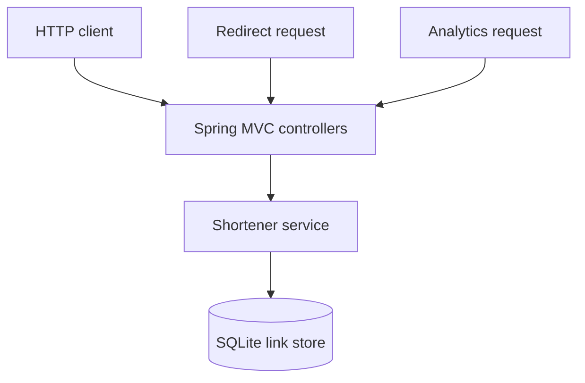
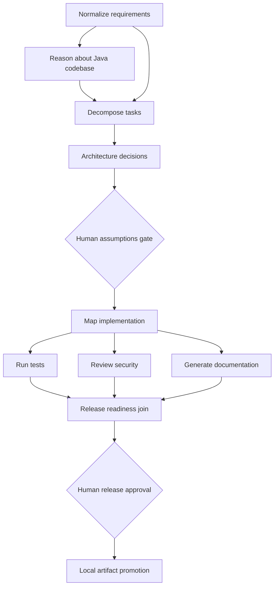

# Architecture and orchestration model

## Service components

Spring MVC validates the request shape, applies a per-process creation limit, and delegates link rules to the domain service. JDBC uses parameterized statements. Click increments run inside a short SQLite `BEGIN IMMEDIATE` transaction so concurrent redirects do not silently lose counts. The stored analytics are aggregate click counts and last-access timestamps; visitor IPs are not persisted.

## Governed SDLC graph

`WorkflowGraph` validates unique stage IDs, known dependencies, and acyclicity. Independent ready stages run in a bounded Java executor; dependents wait for the joined results. Each stage carries a stable ID, owner, dependencies, and optional human checkpoint. `AgentBackend` is the provider seam; orchestration policy and state do not come from an agent response.

## State and decision lineage

`.agentic/state.sqlite3` stores run projections, stage state, approval history, leases, and append-only events. Every run has a unique run ID and trace ID. Stage events record role, attempts, duration, and an output hash. Approval history records the checkpoint, actor, rationale, decision, and timestamp. JSON stage artifacts and the engineering summary are written under `.agentic/runs/{run_id}/artifacts/`.

The run projection is query-friendly and stored alongside its append-only event history. Source and request revisions append a `REPLAN_TRIGGERED` event; old approval records are retained and marked superseded.

## Autonomy and policy

| Action | Agent autonomy | Human or policy control |
| --- | --- | --- |
| Normalize, inspect, plan, design | Execute automatically | Outputs remain reviewable; unclear criteria trigger a gate. |
| Map implementation | Inspect the allowlisted Java workspace and report impacted modules | Cannot edit arbitrary source or execute generated code. |
| Tests, security checks, documentation | Run automatically and concurrently where dependencies allow | Readiness blocks when required checks fail or criteria lack evidence. |
| Ambiguous assumptions | No implementation until a decision | Named human approval with rationale is mandatory. |
| Local release promotion | No production deployment capability | Named human approval, passing checks, and local atomic promotion. |
| Stop and rollback | No model discretion | Operator request is audited; rollback restores the prior local release pointer. |

Agent outputs are limited to 1 MB and written only to orchestrator-selected stage artifact paths. The implementation stage produces a source map; it never applies patches. A future code-writing agent should use an isolated worktree, path allowlists, signed diff review, and sandboxed builds.

## Replanning, retries, and rollback

- A revised request resets all stages and removes stale current artifacts while preserving the append-only audit trail.
- A changed Java source or `pom.xml` fingerprint invalidates repository reasoning and downstream stages before approval can be granted.
- Transient stage errors retry up to the configured attempt limit. Provider unavailability can fall back to the deterministic local backend; the fallback is recorded.
- A failed stage stops the run. No external deployment is attempted, and partial promotion staging is removed.
- Promotion writes an immutable release directory and atomically replaces `.agentic/current_release.json`. The previous pointer is saved with the bundle.
- `rollback-release` is audited and only rolls back the active successful local release. The prior bundle remains available for inspection.
- SQLite leases prevent two runners from executing the same run concurrently; expired leases can be reclaimed after a process exits.

## Observability and metrics

Run events and stage projections are available through `events RUN_ID` and `status RUN_ID`; `metrics` reports:

- **Success rate:** succeeded terminal runs / all terminal runs.
- **Retry count:** total stage attempts beyond the first.
- **Retry frequency:** terminal runs with one or more retries / terminal runs.
- **Rollback count:** completed local release pointer rollbacks.
- **Rollback frequency:** completed rollbacks / terminal runs.
- **MTTR:** average elapsed time for stages that recovered after a retry.
- **End-to-end latency:** mean created-to-terminal duration for terminal runs.

These prototype workflow measures are stored in SQLite. They are not service SLO telemetry and are not exported to an external monitoring backend.

## URL shortener data flow

`POST /api/v1/links` validates HTTP(S) targets, rejects local destinations and embedded credentials, validates or generates a code, then inserts the row. `GET /r/{code}` reads the row and increments its aggregate click count in one transaction before returning a non-cacheable `302`. Expired links return `410`; unknown links return `404`. Per-link aggregate stats are exposed through `GET /api/v1/links/{code}/stats`.

The API contract and examples are documented in the repository README. OpenAPI UI is not included in this prototype.
